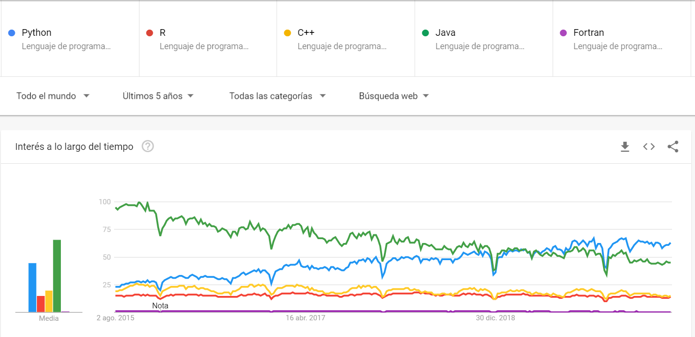

```{r child = "../setup.Rmd"}
```

```{r packages, echo=FALSE, message=FALSE, warning=FALSE}
# AGREGAR PAQUETES A UTILIZAR

```
class: center

## Acerca de mí

.left-column-image[
  
]

.left-column[
- Ingeniería ambiental / UNALM.
- Especialización en Data Science, Machine Learning y Deep Learning / UNALM.
- Consultor en ciencia de datos ambientales en el Centro Internacional de la Papa (CIP - CGIAR) en el proyecto “Evaluación del riesgo del tizón tardío de la papa en el Perú”, y asistente de ingeniería en diversas consultoras y empresas nacionales e internacionales.
- Docente con más de 250 horas de experiencia en el dictado de cursos de Sistemas de Información Geográfica con ArcGIS, QGIS, Google Earth Engine, R y Python.
 ]

---

## ¿Qué es la programación ?

- La programación es el proceso utilizado para idear y ordenar las acciones necesarias para realizar un proyecto de manera eficiente.
- En la actualidad el concepto se encuentra muy ligado a la informática.


---

## ¿Por qué aprender a programar?

- El mundo tecnológico se encuentra en constante crecimiento.
- La programación estimula el pensamiento lógico y crítico, la creatividad, la colaboración efectiva, el análisis sitemático y aprendizaje continuo.
- Los campos de aplicación de la programación son muy diversos.
- La pandemia por el COVID-19 ha cambiado el mundo laboral, posiblemente para siempre.


  


---

## ¿Por qué aprender R?

  

 <a href="https://trends.google.com/" class='center'> Acceder a Google Trends </a>

---

class: syllabus

## Contenido analítico

<b> CLASE 1 : INTRODUCCIÓN A R Y RSTUDIO </b>

- ¿Qué es R?
- Características de R
- ¿Qué es RStudio?
- Características de RStudio
- Paquetes de R
- Ayuda en R
- Sintaxis de R
- Operaciones matemáticas en R

---

class: syllabus

## Contenido analítico

<b> CLASE 2 : ESTRUCTURA DE DATOS EN R </b>

---

## Sistema de evaluación

- Trabajos encargados  &nbsp;  &nbsp;| 30%
- Examen teórico &nbsp;  &nbsp;  &nbsp;  &nbsp;  &nbsp;  &nbsp;  &nbsp; | 30%
- Proyecto final &nbsp;  &nbsp;  &nbsp;  &nbsp;  &nbsp;  &nbsp;  &nbsp;  &nbsp;  &nbsp;| 40% 

<br/>


---

class: inverse, center, middle

# INVESTIGACIÓN REPRODUCIBLE

---

## Git y GitHub

- [Git](https://git-scm.com/) es el sistema de control de versiones más utilizado en el mundo.
- [GitHub](https://github.com/) es una plataforma para alojar proyectos Git.


---

## RMarkdown

- [RMarkdown](https://rmarkdown.rstudio.com/) integra paquetes de R y herramientas externas con la finalidad de proveer un marco de referencia para la construcción de documentación completamente reproducible.


---

class: inverse, center, middle

# GRACIAS! <br/>  <a href="mailto: marvinjqs@gmail.com">  </a> 


