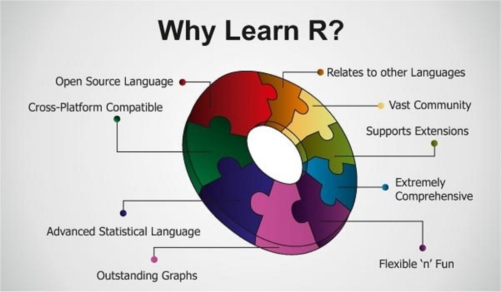
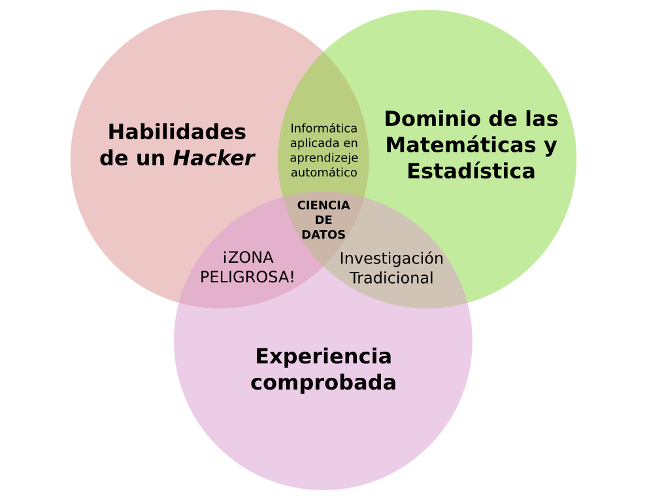
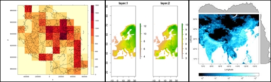
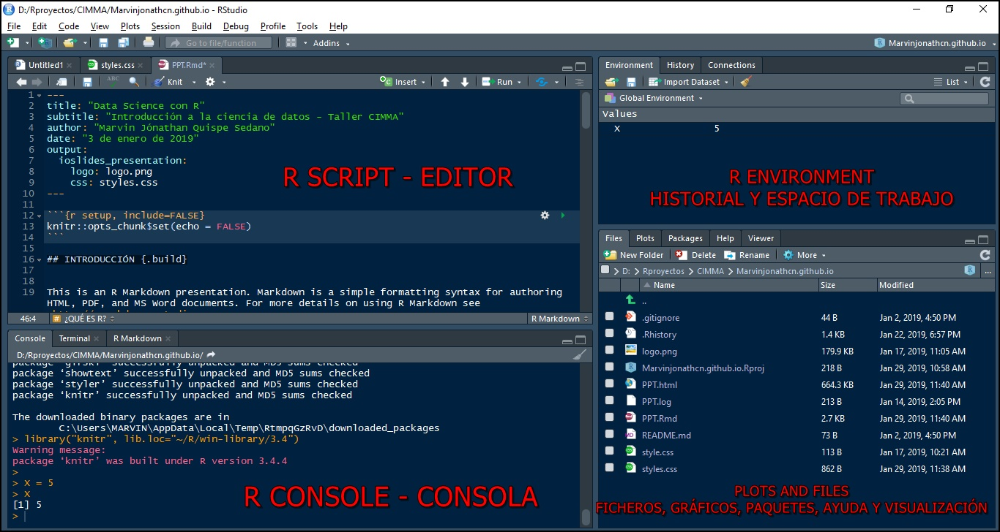
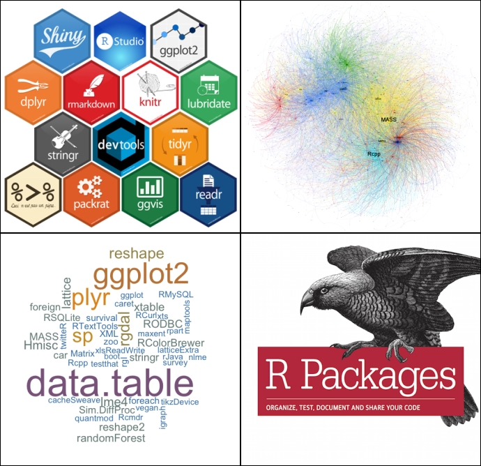

```{r child = "../setup.Rmd"}
```

```{r packages, echo=FALSE, message=FALSE, warning=FALSE}
# AGREGAR PAQUETES A UTILIZAR

```
class: inverse, center, middle

## CLASE 1 
### INTRODUCCIÓN A R

---

## Introducción

- R es un entorno y lenguaje de programación ampliamente usado en la ciencia de datos, principalmente en el análisis estadístico.
- La relación de R con el análisis de datos ambientales se evidencia ampliamente en la gran cantidad de paquetes modulares que se usan con este fin.



---

## Objetivo

- El objetivo del presente curso es proporcionar los conocimientos básicos para empezar a trabajar con el lenguaje de programación R, enfocado a su uso como herramienta principal en la gestión y análisis de datos.



---

## ¿Qué es R?

- R fue creado en 1992 en Nueva Zelanda por Ross Ihaka y Robert Gentleman basandose en la sintaxis del **lenguaje S** desarrollado principalmente por John Chambers en Bell Laboratories y **Scheme** desarrollado por por Guy L. Steele y Gerald Jay Sussman (Ihaka 1998).
- R es un lenguaje de programación interpretado, de **distribución libre**, bajo Licencia GNU, y se mantiene en un ambiente para el cómputo estadístico y gráfico, actualmente ampliamente aplicado para el procesamiento de datos en ciencias (Santana y Farfán 2014).
- R no es un sistema estadístico sino un ambiente en el que se aplican técnicas estadísticas, este software corre en distintas plataformas Linux, Windows, MacOS, e incluso en PlayStation 3 (Santana y Farfán 2014).

---

## Características de R

- El sistema R esta dividido en dos partes conceptuales: El sistema base de R, que es el que puedes bajar de CRAN, y en todo lo demás, principalmente **paquetes** modulares. 
- La capacidad de gráficos de R es muy sofisticada. Existe paquetería para **graficar, crear y manejar shapefiles y archivos raster**; manipular y crear datos en distintos formatos como **netCDF, csv, xlsx, tiff, etc**.




---

## ¿Qué es RStudio?

- RStudio es un entorno de desarrollo integrado (IDE) para el lenguaje R, disponible para Windows, Mac, Linux y en casi **todos los sistemas operativos**.
- Algunas ventajas de usar **RStudio** son : es **libre**, nos permite abrir varios scripts a la vez,  nos permite ejecutar pedazos de código de los scripts, disponibilidad de autocompletado de código, etc.
- Se puede descargar desde los siguientes enlaces : [R v4.1.0](https://cran.r-project.org/bin/windows/base/R-4.1.0-win.exe) y [RStudio](https://download1.rstudio.org/desktop/windows/RStudio-1.4.1717.exe)


---

## Características de RStudio




---

## Paquetes de R

Función | Acción
------------ | -----------------------------------------
library() | Lista de paquetes instalados
install.packages("Nombre_del_paquete") | Instalación de un paquete
library(Nombre_del_paquete) | Cargar un paquete a la sesión
search() | Lista de paquetes instalados y cargados a la sesión
.libPaths() | Directorio en el que 'R' almacena y busca los paquetes

---

## Paquetes de R





---

## Ayuda en R

- R dispone de un buen **sistema de ayuda** , lo que nos ayudará a obtener información de cualquier función en específico, caracter o palabra.

Función | Acción
------------ | -----------------------------------------
help() | Muestra una ventana de ayuda general sobre 'R'
help.start() | Arranca un manual de ayuda completo en formato html, utilizando el navegador del sistema
help(Nombre) o ?Nombre | Muestra una ventana de ayuda sobre una función 
help.search("Nombre") | Muestra un listado de contenidos acerca de una función, caracter y palabra

---

## Sintaxis de R

- Ejemplo de un comentario: 

```{r , echo = TRUE }
# LOS COMENTARIOS EN "R" EMPIEZAN CON EL CARÁCTER '#'
# -----------------------------------------------------

```
- La forma en la que se asigna un valor a una variable:

```{r , echo = TRUE }

u <- 5

```

- La función 'print' nos ayudará a imprimir un valor de una variable en la consola:

```{r , echo = TRUE }
print(u) 

```

---

- También se puede imprimir su valor digitando la variable: 

```{r , echo = TRUE }
u
```
- 'R' funciona como una calculadora, ejemplo :

```{r , echo = TRUE }
((5*5+3+5)^2) + 5/2

log((1/pi)* 5) #Logaritmo neperiano

```

---

```{r , echo = TRUE }

v <- 1/Inf #Divide un número por Infinito
v

w <- 0/0 ; v # Indeterminado

p = 758.9 # Presión en mmHg
patm = p*(1/760.0021) ; patm # Presión en atmósferas

```
---

## Operaciones matemáticas en R


---

class: inverse, center, middle

# GRACIAS! <br/>  <a href="mailto: marvinjqs@gmail.com">  </a> 


