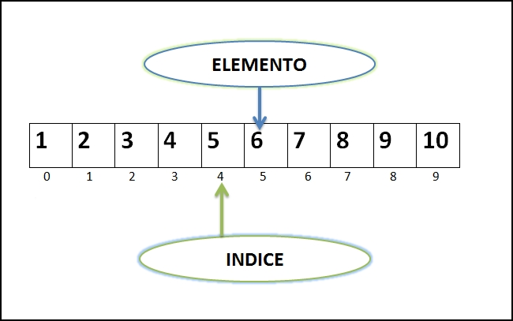
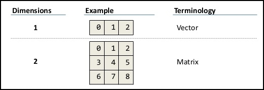
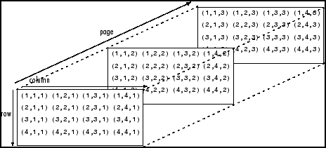
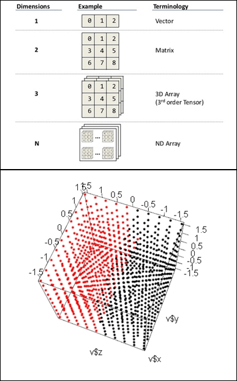
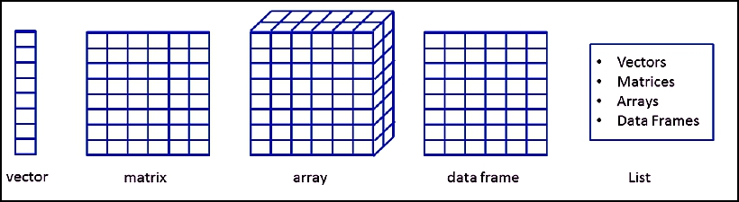

```{r child = "../setup.Rmd"}
```


```{r packages, echo=FALSE, message=FALSE, warning=FALSE}
# AGREGAR PAQUETES A UTILIZAR

```
class: inverse, center, middle

## CLASE 2 
### EL MANEJO DE DATOS EN R

---

## Introducción

- Los datos describen algún suceso y/o entidad mediante una representación alfanúmerica, lo que permite poder analizarlos posteriormente.
- Los datos por sí mismos no constituyen la información, se necesita interpretarlos para lograr ello.
- El almacenamiento de los datos en R se da mediante lo que se denomina **objetos**.


---

## Tipos de datos en R

- Todas las cosas que manipula R se llaman objetos, por ello se dice que **R esta orientado a objetos** (Santana y Farfán 2014).
- Los objetos son **estructuras que combinan datos y funciones** que operan sobre ellos y son muy útiles en un entorno como R (Gil 2018).
- En general, cada tipo de objeto viene definido por una serie de atributos. Las funciones genéricas (como por ejemplo *summary* o *plot*) reconocen estos atributos y llevan a cabo distintos tipos de acciones en función del tipo de objeto (Amazon AWS 2019).

---

## Tipos de datos en R

Clases atómicas | Descripción | Ejemplo
------------ | ------------ | ------------
Character | Cadenas de caracteres | cimma <- "minería"
Numeric | Números reales | g <- 9.8
Integer | Números enteros | edad <- 20L
Complex | Números complejos | u <- 5 + 2i
logical | Lógicos o booleanos | v <- FALSE
NA | Datos perdidos o faltantes | w <- NA
NaN | Datos indeterminados | z <- NaN

---

## Estructura de datos en R

Objetos | Tipos | Varios Tipos
------------ | ------------ | ------------
Vector | Numérico, caracter, complejo o lógico | NO
Factor | Numérico o caracter | NO
Array | Numérico, caracter, complejo o lógico | NO
Matrix | Numérico, caracter, complejo o lógico | NO
Data frame | Numérico, caracter, complejo o lógico | SI
ts | Numérico, caracter, complejo o lógico | SI
List | Numérico, caracter, complejo, lógico, función, expresión, etc. | SI

---

## Estructura de datos en R


---

class: inverse, center, middle

## TIPOS DE DATOS 


---

## Vector

- Cada uno de las clases de **objetos más simples o *atómicas* ** no se encuentran ni se manejan de manera aislada, sino encapsulados dentro de la clase de objeto más básica del lenguaje R: **el vector** (Santana y Farfán 2014).
- Un **vector** puede contener cero o más objetos, pero todos de la misma clase (Santana y Farfán 2014).




---

```{r , echo = TRUE , collapse = TRUE}

c(5,7,9,-15) # Creación de un vector sin asignarlo a una variable

u <- c(5,7,9,-15) # Creación de un vector asignandolo a una variable
card <- c("E","W","N","S")

assign("w", c(5,7,9,-15)) # La función 'assign' asigna un vector a una variable
```

```{r , echo = TRUE, collapse = TRUE}

print(u); print(w)

```

*NOTA: La impresión del vector se hace en un renglón que comienza con el símbolo ’[1]’, indicando con ello que el primer elemento del renglón corresponde al primer elemento del vector.*

---

- Creación de vectores a partir de patrones o secuencias:

```{r , echo=TRUE, collapse= TRUE}

v <- vector("integer", 0)
v # Un vector de enteros sin elementos

w <- vector("numeric", 5)
w # Un vector de tres ceros
```

- El operador ’:’ genera un vector a partir de una secuencia de enteros:
  
```{r , echo=TRUE, collapse= TRUE}
x <- 50:80 ; y = pi:7
print(x); class(x) ; print(y) 

```
---

- La función "seq()" permite generar mayor variedad de secuencias numéricas:

```{r , echo=TRUE, collapse= TRUE}

u <- seq(from = 2, to = 19, by = 2)
print(u) # secuencia desde 2 hasta 18 de 2 en 2

v <- seq(from = 3, by = 3, length.out = 8)
print(v) # secuencia de 8 números iniciando desde 3 y de 3 en 3

```

- La función "rep()" permite repetir una secuencia de números varias veces:

```{r , echo=TRUE, collapse= TRUE}
v <- c(pi, -3, 1+3i)
w <- rep(v, times = 2)
print(w) ; class(w)
```

---

- La función "c()" permite construir vectores a partir de otros:

```{r , echo=TRUE, collapse= TRUE}

u <- c(3, 4, 5)
v <- c(5, 4, 3)
w <- c(u, v)
```

- Acceso a un elemento individual de un vector:

```{r , echo=TRUE, collapse= TRUE}

u <- c(18, 75, -2.33, 72)
u[3] # El cuarto elemento

u[4]+u[2] # La suma del cuarto y segundo elementos de 'u'

```
---

- Poner nombres a los elementos individuales de un vector:

```{r , echo=TRUE, collapse= TRUE}

temp <- c(28, 29, 29, 30) #Temperatura ambiente
names(temp) <- c("a", "b", "c", "d")       # OTRA FORMA :  temp <- c(a=28, b=29 ....

temp

temp["b"]

temp["b"] <- 28
temp

```

---

- Operaciones matemáticas con vectores 

```{r , echo=TRUE, collapse= TRUE}
v <- 4 + 34 + 2      # Resulta en un vector de longitud 1
v

v <- c(21, 13) - c(4, 17)     # Resulta en un vector de longitud 2
v

v <- c(2, 3, 4) * c(2, 1, 3)     # Resulta en un vector de longitud 3
v

v <- c(1, 2, 3, 4)^(4:1)     # Eleva a potencias 4,3,2,1
v

```
---

- Manejo de funciones trigonométricas:

```{r , echo=TRUE, collapse= TRUE}

# Para obtener el seno de 30, 45 y 60 grados:

# Primero se hace la conversión a radianes

angulos <- c(30, 45, 60) * (pi/180)
angulos # En radianes

# Luego se aplica la función trigonométrica
# sin() , cos() , tan() ....

senos <- sin(angulos)
senos

```

---

## Matriz

- Es una estructura de datos **bidimensional** (DATAMENTOR 2018).
- La matriz es similar al vector,  pero adicionalmente contiene el atributo: ***dim*** (dimensión) (DATAMENTOR 2018). Este atributo es un vector entero de dos elementos : el número de renglones y el número de columnas que componen a la matriz (Santana y Farfán 2014).




---

## Array

- Un **Array** es una **estructura de datos**. Puede ser de **1D** (por ejemplo, números, cadenas, etc.), **2D** (por ejemplo, información de color de píxeles de una imagen), **3D** (por ejemplo, tabla de datos) o cualquier **n Dimensiones** (QUORA 2015). 
- Se crea utilizando la función *array ()*, usando vectores como entrada y el parámetro *dim*.



---

- Creación de un array:

```{r , echo=TRUE, eval= FALSE}
# CREACIÓN DE DOS VECTORES DE DIFERENTES LONGITUDES
vector1 <- c(54,-8,4)
vector2 <- c(1,7,18,14,-4,15.5)
column.names <- c("COL1","COL2","COL3")
row.names <- c("ROW1","ROW2","ROW3")
matrix.names <- c("Matrix1","Matrix2")

# LOS VECTORES ANTERIORES SERÁN LA ENTRADA DE NUESTRO 'ARRAY'
result <- array(c(vector1,vector2),dim = c(3,3,2),
          dimnames = list(row.names,column.names,matrix.names))

print(result)
```

---



---

- Construcción de matrices:

```{r , echo=TRUE, collapse= TRUE}

m <- 1:20 # Un vector con 20 números
dim(m) <- c(4, 5) # 4 renglones y 5 columnas
class(m); m

#LAS DIMENSIONES TAMBIÉN SE PUEDEN CAMBIAR
dim(m) <- c(5, 4) ; m

```

---

- Selección de elementos en una matriz:

```{r , echo=TRUE, collapse= TRUE}

#SELECCIÓN DE UN ELEMENTO (FILA Y COLUMNA)
 m[4,2]
#SELECCIÓN DE UN ELEMENTO (POR POSICIÓN)
m[7]
#SELECCIONAR LOS ELEMENTOS DE UNA COLUMNA O FILA
m[3, ] 

m[,3 ]

class(m[, 3])

```

---

- Modificar el nombre de los atributos de una matriz:

```{r , echo=TRUE, collapse= TRUE}
#ASIGNAR NOMBRES A FILAS Y COLUMNAS
rownames(m) <- c("uno", "dos", "tres", "cuatro", "cinco")
colnames(m) <- c("a", "b", "c", "d") ; m

n <- matrix(1:12, nrow = 3, ncol = 4, byrow = TRUE)
n
```

---

- Las funciones *rbind()* y *cbind()* se pueden utilizar para construir matrices:

```{r , echo=TRUE, collapse= TRUE}
u <- rbind(c(1.5, 3.2, -5.5), c(0, -1.1, 60))
u
```
- Una manera fácil de crear matrices:

```{r , echo=TRUE, collapse= TRUE}
v <- matrix(1:6, 3, 2) ; v

```

---

- La multiplicación matricial se hace con el operador '%*%' :

```{r , echo=TRUE, collapse= TRUE}
n <- matrix(1:6, 3, 2)
m <- rbind(8:10, 10:12)
x <- n%*%m

#LA TRANSPUESTA DE LA MATRIZ 'x' SE OBTIENE CON 't(A)'
t(x)

```
---

## Caracteres

- En R, las cadenas de caracteres son **vectores** utilizados para nombrar objetos (Santana y Farfán 2014).
- Un fragmento de texto se representa como una secuencia de caracteres (letras, números y símbolos) (Sánchez 2019).

```{r , echo=TRUE, collapse= TRUE}
persona <- c("Hugo", "Mario", "Luis")
meses<- c("Dic", "Feb", "Oct")
paises <- c("Brasil","Perú","Colombia")
gasesdeefec <- c( "CO2", "CH4" , "N2O", "CFC")

```

---

## Factores

- Un factor puede considerarse como una *estructura de información*, a la que se puede someter a algún tipo de procesamiento estadístico, cuyo núcleo son dos vectores: **los niveles (*levels*) y un vector de índices enteros** (Santana y Farfán 2014).
- En R, se utilizan habitualmente para realizar clasificaciones de los datos, estableciendo su pertenencia a los grupos o categorías determinados por los *levels* (Santana y Nieves 2014).
- Los niveles de un factor puede estar codificados como valores numéricos o como caracteres (Santana y Nieves 2014). 

---

- Transformamos el vector a factor mediante la función 'as.factor()'

```{r , echo=TRUE, collapse= TRUE}
sexo <- c("M", "H", "H", "M", "H", "H", "H", "M", "H", "M")
sexo <- as.factor(sexo) ; sexo

#COMO SE PUEDE VER EL NÚCLEO DE LA CLASE SON DOS VECTORES :
unclass(sexo)
```

- La función 'table()' nos da como resultado la frecuencia de aparición:

```{r , echo=TRUE, collapse= TRUE}
table(sexo)
```

---

- Se puede establecer un orden determinado en los niveles:

```{r , echo=TRUE, collapse= TRUE}
mesdenac <- c("Dic", "Feb", "Oct", "Mar", "Feb", "Nov","Abr", "Dic", "Feb", "Oct")
meses <- c("Ene","Feb","Mar","Abr","May","Jun","Jul","Ago", "Sep","Oct","Nov","Dic")

m <- factor(mesdenac, levels= meses) ; m

levels(m)[2] <- "marzo" ; m

```
<center>  </center>

---

## Listas

- Una lista es una clase de datos que puede contener cero o más elementos, cada uno de los cuales puede ser de una **clase distinta** (Santana y Farfán 2014).
- Al igual que los vectores, **los elementos de la lista pueden ser nombrados**, lo que añade mayor claridad a su significado (Santana y Farfán 2014).


---

- Construcción de una lista que represente una familia:

```{r , echo=TRUE, collapse= TRUE}
listfam<- list(hombre = "Juan", mujer = "Sonia", casados = TRUE, numero.hijos = 3, nombre.hijos=c('Hugo', 'Paco', 'Mary'))
listfam
```

---

- Una lista puede contener otra lista:

```{r , echo=TRUE, collapse= TRUE}
l1 <- list(nombre= "Marcos",nacimiento= 1986) ;  l2 <- list(nombre= "Juan", DNI = 46174852)
l3 <- list(l1,l2) ; l3
```

---

## Dataframe

- Un *dataframe* es una lista, cuyos componentes pueden ser vectores, matrices o factores, con la única salvedad de que las longitudes deben coincidir en todos los componentes (Santana y Farfán 2014).
- La estructura de un *dataframe* es muy similar a la de una matriz, La diferencia es que una matriz sólo admite valores numéricos, mientras que en un *dataframe* podemos incluir también datos alfanuméricos (Santana y Nieves 2014).




---

class: inverse, center, middle

## IMPORTAR Y EXPORTAR DATOS


---

## Ingresar datos manualmente

- La función "readline()" nos permite ingresar datos manualmente mediante la consola para que posteriormente se almacenen en un objeto.
- La librería "svDialogs" nos permite ingresar datos manualmente mediante una ventana emergente para que posteriormente se almacenen en un objeto.
- La función "winDialog()" del paquete "utils" nos permite crear botones de diálogo de Windows para responder a una solicitud.


---

- Ingresar datos usando la función "readline()"

```{r , echo=TRUE, collapse= TRUE}

# LA FUNCION readline NOS PERMITE INGRESAR DATOS EN LA CONSOLA

nombre <- readline(prompt="Ingrese su nombre y apellidos: ")
edad <- readline(prompt="Ingrese su edad: ")
dni <- readline(prompt="Ingrese su DNI: ")

print(paste("Hola,", nombre, 
            "Identificado con DNI:", dni, 
            ",con", edad, "años de edad."))

```

---

- Ingresar datos usando la función "dlgInput()"

```{r , echo=TRUE, collapse= TRUE}

# LA FUNCION dlgInput NOS PERMITE INGRESAR DATOS EN LA VENTANA EMERGENTE

library(svDialogs)

nombre <- dlgInput(message=="Ingrese su nombre y apellidos: ")$res
edad <- dlgInput(message=="Ingrese su edad: ")$res
dni <- dlgInput(message=="Ingrese su DNI: ")$res

print(paste("Hola,", nombre, 
            "Identificado con DNI:", dni, 
            ",con", edad, "años de edad."))


```
---

- Ingresar la respuesta a una premisa usando la función "winDialog()"

```{r , echo=TRUE, collapse= TRUE, eval=FALSE}

# LA FUNCION dlgInput NOS PERMITE INGRESAR DATOS EN LA VENTANA EMERGENTE

library(utils)

winDialog(type="ok", message="¿Está seguro de borrar su información?")
winDialog(type="okcancel", message="¿Desea proceder con el análisis?")
winDialog(type="yesno", message="¿Desea seguir con la instalación?")
winDialog(type="yesnocancel", message="¿Desea guardar su archivo antes de cerrar?")

respuesta <- winDialog(type="yesno", mess="¿Desea guardar su archivo antes de cerrar?")

if (answer=='YES') {
  print('Su archivo fue guardado!')
  } else {
  print('Lástima')
  }

```
---

## Descargar datos desde un link URL

- La función "download.file()" nos permite descargar datos a nuestro directorio de trabajo mediante el link que los contiene.

```{r , echo=TRUE, collapse= TRUE, eval=FALSE}

# LA FUNCION dlgInput NOS PERMITE DESCARGAR DATOS DESDE UN URL

getwd()

download.file(
  url = "https://gml.noaa.gov/webdata/ccgg/trends/co2/co2_annmean_mlo.txt", 
  destfile = "mauna-loa-data.csv"
  )

```
---

## Importar archivos de datos

- Dependiendo del tipo de estructura de datos encontraremos librerías específicas para la importación de archivos de datos.
- La función "read.table()" nos permite importar cualquier tipo de archivo que contenga una tabla a nuestro proyecto. La condición para el uso de esta función es una separación definida de cada columna o variable por espacios, comas, o algún otro carácter.

```{r , echo=TRUE, collapse= TRUE, eval=FALSE}

# LA FUNCION read.table() nos permite importar archivos de datos

download.file(
  url = "https://gml.noaa.gov/webdata/ccgg/trends/co2/co2_annmean_mlo.txt", 
  destfile = "mauna-loa-data.csv"
  )

data <- read.table(file = "mauna-loa-data.csv")
```

---

- Visualizar los primeros elementos del dataframe:

```{r , echo=TRUE, collapse= TRUE}

download.file(
  url = "https://gml.noaa.gov/webdata/ccgg/trends/co2/co2_annmean_mlo.txt", 
  destfile = "mauna-loa-data.csv"
  )

data <- read.table(file = "mauna-loa-data.csv")

head(data, 10)

```

---

## Exportar archivos de datos

- Dependiendo del tipo de estructura de datos encontraremos librerías específicas para la exportación de archivos de datos. 
- La función "write.table()" nos permite exportar matrices o dataframes como archivos de texto con distintas extensiones.


---

- Exportar un dataframe a nuestro directorio de trabajo:

```{r , echo=TRUE, collapse= TRUE, eval= FALSE}

# LA FUNCION download.file() NOS PERMITE EXPORTAR DATAFRAMES

download.file(
  url = "https://gml.noaa.gov/webdata/ccgg/trends/co2/co2_annmean_mlo.txt", 
  destfile = "mauna-loa-data.csv"
  )

data <- read.table(file = "mauna-loa-data.csv")

names(data) <- c("YEAR", "MEAN_CO", "UC")

write.table(data, file = "mauna-loa-data2.csv", header = T)

```


---

class: inverse, center, middle

# GRACIAS! <br/>  <a href="mailto: marvinjqs@gmail.com">  </a> 


