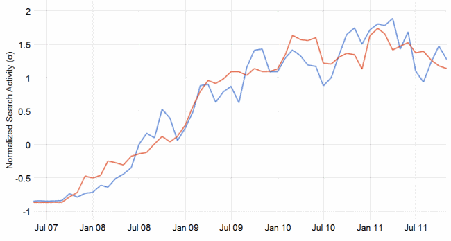
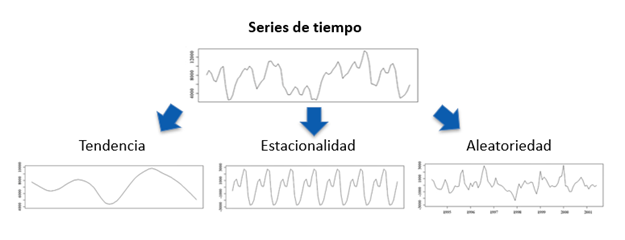

```{r child = "../setup.Rmd"}
```


```{r packages, echo=FALSE, message=FALSE, warning=FALSE}
# AGREGAR PAQUETES A UTILIZAR

```
class: inverse, center, middle

## CLASE 4 
### HORARIOS Y FECHAS CON R

---

## Introducción

- Las datos que se obtienen en intervalos de tiempo definidos en la mayoría de los casos se almacenan en una base de datos que contiene el tiempo exacto en el que fue tomado el valor.
- El lenguaje de programación R, dispone de dos clases específicamente diseñadas para el manejo de fechas dentro de su entorno.



---

## Clases de horarios y/o fechas

- En R, disponemos de dos clases para los horarios y/o las fechas.
- La clase **Date** solo pude almacenar fechas.
- La clase **POSIXt** puede almacenar la fecha, hora y huso horario.




---

## Clase "Date"

- La clase **Date** almacena las fechas como el número de días transcurridos desde el 1 de enero de 1970, para las fechas anteriores el número se encuentra en sentido negativo. La función **unclass** nos permite conocer el valor numérico de una fecha.
- La función **as.Date()**, te permite crear un objeto de tipo **Date**.
- La función **Sys.Date()** te permite obtener la fecha actual de nuestro ordenador en formato **Date**.

---

- Creamos un objeto de clase **Date**.

```{r , echo = TRUE , collapse = TRUE}

# CREANDO UN OBJETO DE TIPO DATE 

new_year =as.Date("31/12/2020",format="%d/%m/%Y")
new_year

new_year2 =as.Date("31-12-2020",format="%d-%m-%Y")
new_year2

new_year3 =as.Date("31 Diciembre 2020",format="%d %B %Y")
new_year3

# CAMBIAR FORMATO DE UNA FECHA

format(new_year,"%A, %d de %B de %Y")

unclass(new_year)

```

---

## Formato de horarios y fechas

Símbolo | Significado 
------------ | ------------ 
%d | Día (numérico, de 1 a 31)
%a | Día de la semana abreviado a tres letras
%A | Día de la semana (completo)
%m | Mes (numérico, de 1 a 12)
%b | Mes abreviado a tres letras
%B | Mes (completo)
%y | Año con dos dígitos
%Y | Año completo

---

## Secuencias de horarios y fechas

- La función **seq()**, también nos permite crear secuencias de horarios y fechas de manera rápida especificando los valores de inicio, final y/o el intervalo.

```{r , echo = TRUE , collapse = TRUE}

# CREANDO UN OBJETO DE TIPO DATE 

date1 =as.Date("31/12/2020",format="%d/%m/%Y")
date2 =as.Date("30-11-2020",format="%d-%m-%Y")

# CREAR UNA SECUENCIA DE FECHAS

seq1 <- seq(date2, to = date1, by = "1 day")
seq1 <- seq(date2, to = date1, by = "week")


```
---

## Clase "POSIXct" y "POSIXlt"

-  El almacenamiento interno de un objeto de clase **POSIXct** es el número de segundos transcurridos desde el 1 de enero de 1970. Mientras que el objeto con clase **POSIXlt** almacena internamente una lista que contiene el año, mes, dia, hora, minutos y segundos en componentes separadas.
- Aunque el almacenamiento interno de las dos clases de objetos **POSIX** son diferentes, ambos ejecutan sus operaciones llevando la fecha a segundos.

---

- Creamos un objeto de clase **POSIXct**.

```{r , echo = TRUE , collapse = TRUE}

# CREANDO UN OBJETO DE TIPO POSIXct

new_year =as.POSIXct("31/12/2020",format="%d/%m/%Y")
new_year

new_year2 =as.POSIXct("31-12-2020 09:00",format="%d-%m-%Y %H:%M")
new_year2

new_year3 = as.POSIXct("31-12-2020 09:00",format="%d-%m-%Y %H:%M", tz="UTC")
new_year3

# 

unclass(new_year)


```

---

- Creamos un objeto de clase **POSIXlt**.

```{r , echo = TRUE , collapse = TRUE}

# CREANDO UN OBJETO DE TIPO POSIXlt

new_year =as.POSIXlt("31/12/2020",format="%d/%m/%Y")
new_year

new_year2 =as.POSIXlt("31-12-2020 09:00",format="%d-%m-%Y %H:%M")
new_year2

new_year3 = as.POSIXlt("31-12-2020 09:00",format="%d-%m-%Y %H:%M", tz="UTC")
new_year3

# 

# unclass(new_year)

new_year$mday

new_year$year

```

---


class: inverse, center, middle

# GRACIAS! <br/>  <a href="mailto: marvinjqs@gmail.com">  </a> 


